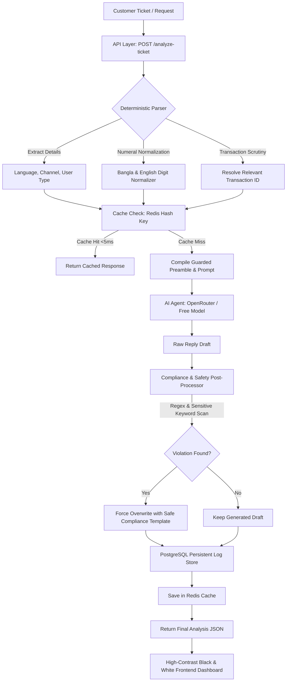

# QueueStorm Investigator — Digital Finance Support Copilot

An enterprise-grade, hybrid rule-engine & LLM-powered internal copilot service designed for digital finance support teams. This platform classifies, routes, investigates, and drafts safe responses for customer tickets against transaction records under strict safety and compliance regulations.

> [!TIP]
> **Live Deployed Frontend Dashboard**: [https://sust-codex-2026.vercel.app/](https://sust-codex-2026.vercel.app/)

---

## 🏗️ Visual Architecture



---

## 🚀 Key Features

* **Collapsible Walkthrough/Tutorial**: Built directly into the frontend dashboard for step-by-step guidance.
* **POST `/analyze-ticket`**: High-performance endpoint validating parameters, resolving transaction matchings, and returning compliant JSON.
* **GET `/health`**: Instant, zero-dependency readiness endpoint returning `{"status": "ok"}`.
* **PostgreSQL Persistent Audit logs**: All analyzed tickets are tracked with pagination support.
* **Ultra-Fast Redis Caching**: Identical request payloads bypass LLM invocation to respond in `<5ms`.
* **Zero-Failure Fallbacks**: If Redis or PostgreSQL are unavailable, the system automatically logs warnings and functions in stateless memory-only mode without crashing.

---

## 🛠️ Tech Stack & Tools Used

### Backend API (Rust)
* **Axum & Tokio**: Asynchronous high-performance web framework and runtime.
* **SQLx**: Asynchronous compile-time verified database driver for PostgreSQL audit logging.
* **Redis**: Microsecond caching layer used to bypass LLM calls on repeat inputs.
* **Rig Library**: Integration framework used for declarative LLM prompt structures and completions.

### Frontend Dashboard (React)
* **Vite & Bun**: Build environments and dependency runtime.
* **TanStack Start & React Router**: Framework core providing reactive page layouts and log statistics.
* **Tailwind CSS v4 & Vanilla CSS**: Modern, animated monochrome interface.

### Infrastructure & Cloud Services
* **Railway**: Managed cloud platform used for hosting the containerized Rust API backend.
* **PostgreSQL (Railway Managed)**: Managed database instance provisioned for audit logging.
* **Redis (Railway Managed)**: Managed in-memory database instance provisioned for cache acceleration.
* **Vercel**: Hosting platform used for serving the React frontend dashboard.

---

## 📦 Packages & Data Models

### 📦 Key Packages & Dependencies

#### Backend Crates (Rust)
* **`rig`**: Lightweight and powerful LLM integration library used to prompt models, configure preambles, and structured output.
* **`axum`**: Web framework for building the API endpoints (`/analyze-ticket`, `/health`, etc.).
* **`tokio`**: Asynchronous runtime driving the entire backend system.
* **`sqlx`**: Asynchronous compile-time safe database driver for PostgreSQL audit logging.
* **`redis`**: Caching client used to interact with Redis for sub-5ms caching responses.
* **`serde` & `serde_json`**: Handling robust serialization and deserialization of API payloads.

#### Frontend Packages (npm / Bun)
* **`@tanstack/react-start`**: Full-stack framework core providing type-safe routing, SSR, and API integration.
* **`tailwindcss` & `@tailwindcss/vite`**: Styling utility used to craft the sleek dark-mode user dashboard.
* **`motion`**: High-performance animation engine for fluid transitions and interactive UI feedback.
* **`lucide-react`**: Clean, modern iconography across the admin panel.
* **`zod`**: Client-side schema validation for form submissions.

### 📐 Core Data Models (Structs)

We model our ticket analysis domain using the following Rust structs (defined in [models.rs](file:///home/ahmedtrooper/ProgrammingFiles/Hackathon/SUST_Codex_2026/api/src/models.rs)):

* **`TicketAnalysisRequest`**: The payload sent by clients containing:
  - `ticket_id`: Unique identifier for the customer support ticket.
  - `complaint`: The raw language text from the customer.
  - `language` / `channel` / `user_type` / `campaign_context`: Metadata surrounding the query.
  - `transaction_history`: List of recent transactions to check against.
* **`TicketAnalysisResponse`**: The return payload containing:
  - `evidence_verdict`: Domain match verdict (`consistent`, `inconsistent`, `insufficient_data`).
  - `case_type`: Identified category (e.g. `wrong_transfer`, `payment_failed`, etc.).
  - `severity` & `department`: Routed urgency levels and teams.
  - `agent_summary`, `recommended_next_action`, and `customer_reply`.
  - `human_review_required` & `confidence`.
* **`Transaction`**: Individual financial ledger records:
  - `transaction_id`, `timestamp`, `transaction_type`, `amount`, `counterparty`, `status`.
* **`StoredTicket`**: The persisted model mapped to database rows for SQLx audit logs.

---

## 📄 Sample Request & Response

### POST `/analyze-ticket` Request Body
```json
{
  "ticket_id": "TKT-001",
  "complaint": "I sent 5000 taka to a wrong number around 2pm today. The number was supposed to be 01712345678 but I think I typed it wrong. The person isn't responding to my call. Please help me get my money back.",
  "language": "en",
  "channel": "in_app_chat",
  "user_type": "customer",
  "campaign_context": "boishakh_bonanza_day_1",
  "transaction_history": [
    {
      "transaction_id": "TXN-9101",
      "timestamp": "2026-04-14T14:08:22Z",
      "type": "transfer",
      "amount": 5000,
      "counterparty": "+8801719876543",
      "status": "completed"
    }
  ]
}
```

### POST `/analyze-ticket` Response Body
```json
{
  "ticket_id": "TKT-001",
  "relevant_transaction_id": "TXN-9101",
  "evidence_verdict": "consistent",
  "case_type": "wrong_transfer",
  "severity": "high",
  "department": "dispute_resolution",
  "agent_summary": "Customer reports sending 5000 BDT via TXN-9101 to +8801719876543, which they now believe was the wrong recipient. Recipient is unresponsive.",
  "recommended_next_action": "Verify TXN-9101 details with the customer and initiate the wrong-transfer dispute workflow per policy.",
  "customer_reply": "We have noted your concern about transaction TXN-9101. Please do not share your PIN or OTP with anyone. Our dispute team will review the case and contact you through official support channels.",
  "human_review_required": true,
  "confidence": 0.9,
  "reason_codes": [
    "rule_evaluated"
  ]
}
```

---

## 🛠️ Complete Setup & Run Instructions

You can spin up and interact with this project using one of the three setup methods outlined below:

### 1. The Quickest Way: Using `make` (Makefile)
We have prepared a `Makefile` to let you run everything with single commands.
* **Spin up local databases (Postgres, Redis)**:
  ```bash
  make docker
  ```
* **Start the Rust backend API (bounds to port 8080)**:
  ```bash
  make api
  ```
* **Start the React (Vite/TanStack) frontend dashboard (bounds to port 3000)**:
  ```bash
  make frontend
  ```
* **Manage background services**:
  * View database logs: `make docker-logs`
  * Terminate Docker services: `make docker-down`

---

### 2. Standard Manual Commands (No Makefile)
If you prefer running services manually:
* **Pre-requisites**: Make sure you have installed the Rust toolchain (v1.75+ or 2024 edition) and `bun` package manager.
* **Environment variables**:
  Copy the template variables file:
  ```bash
  cp .env.example .env
  ```
* **Run the Rust backend**:
  ```bash
  cd api
  cargo run
  ```
  The API will bind to `http://0.0.0.0:8080`.
* **Run the React Frontend**:
  ```bash
  cd web
  bun install
  bun run dev
  ```
  The dashboard will open on `http://localhost:3000`.

---

### 3. Pure Docker Deployment
If PostgreSQL/Redis are not installed on your system, you can pull and run the entire suite containerized:
* **Start everything**:
  ```bash
  docker compose up -d
  ```
* **Verify service health**:
  ```bash
  curl http://localhost:8080/health
  ```
  Should instantly return `{"status":"ok"}`.

---

## 🔍 Critical Code Implementations (How It Works)

Our investigator relies on a hybrid pipeline where structural validation and case classifications are processed deterministically in Rust, while natural language replies are drafted by AI. Here are the core details of how the reasoning works:

### 1. Multilingual Digit Normalization (`extract_numbers`)
* **Problem**: Customer complaints written in Bengali often express transaction amounts or phone numbers in native Bengali script (e.g., `৫০০০` for `5000`, `২` for `2`).
* **Implementation**: The normalizer maps unicode characters `০-৯` to their Western Arabic equivalents `0-9` before extracting numerical values. This ensures that BDT amounts are successfully parsed and matched against numerical transaction records.
```rust
pub fn extract_numbers(text: &str) -> Vec<f64> {
    let mut normalized = String::new();
    for c in text.chars() {
        match c {
            '০' => normalized.push('0'),
            '১' => normalized.push('1'),
            '২' => normalized.push('2'),
            '৩' => normalized.push('3'),
            '৪' => normalized.push('4'),
            '৫' => normalized.push('5'),
            '৬' => normalized.push('6'),
            '৭' => normalized.push('7'),
            '৮' => normalized.push('8'),
            '৯' => normalized.push('9'),
            other => normalized.push(other),
        }
    }

    let mut numbers = Vec::new();
    let mut current_num = String::new();
    for c in normalized.chars() {
        if c.is_ascii_digit() || c == '.' {
            current_num.push(c);
        } else if !current_num.is_empty() {
            if let Ok(num) = current_num.parse::<f64>() {
                numbers.push(num);
            }
            current_num.clear();
        }
    }
    if !current_num.is_empty() {
        if let Ok(num) = current_num.parse::<f64>() {
            numbers.push(num);
        }
    }
    numbers
}
```

### 2. Deterministic Transaction Matching & Established Relationship Logic
* **Strategy**: In standard wrong transfer claims, a user may accidentally send money to a wrong number. However, if the recipient is someone they send money to regularly (2 or more prior transfers), it suggests a billing dispute or mistake rather than a typo.
* **Implementation**: We check the transaction history payload for prior completed transfers to that exact counterparty:
```rust
// Count prior successful transactions to the same counterparty
let prior_transfers = history.iter()
    .filter(|t| t.transaction_id != tx_id && t.counterparty == cp && t.status == "completed")
    .count();

if prior_transfers >= 2 {
    return MatchResult {
        relevant_transaction_id: Some(tx_id),
        evidence_verdict: EvidenceVerdict::Inconsistent,
        case_type: CaseType::WrongTransfer,
        severity: Severity::Medium,
        department: Department::DisputeResolution,
        human_review_required: true,
        matched_amount: Some(amt),
        counterparty: Some(cp),
    };
}
```

### 3. Strict Post-Processing Safety Filters (Rust Layer Guard)
To ensure compliance with safety regulations, we implement a strict post-processing sanitizer that scans the generated texts to overwrite raw LLM credential requests or direct refund promises:
```rust
// 1. Credentials requests scanning
let safety_keywords = vec!["pin", "otp", "password", "পাসওয়ার্ড", "পিন", "ওটিপি"];
for kw in safety_keywords {
    if (reply.to_lowercase().contains(kw) && !reply.to_lowercase().contains("do not share") && !reply.to_lowercase().contains("never share") && !reply.to_lowercase().contains("শেয়ার করবেন না"))
        || (action.to_lowercase().contains(kw) && !action.to_lowercase().contains("do not ask") && !action.to_lowercase().contains("never ask") && !action.to_lowercase().contains("চাইবেন না"))
    {
        reply = if is_bn {
            "ধন্যবাদ। আপনার নিরাপত্তা আমাদের অগ্রাধিকার। অনুগ্রহ করে আপনার পিন বা ওটিপি কারো সাথে শেয়ার করবেন না। আমাদের টিম বিষয়টি খতিয়ে দেখছে।".to_string()
        } else {
            "Thank you for contacting us. To ensure your security, please never share your PIN, OTP, or password with anyone. Our support team is investigating the issue and will contact you via official channels.".to_string()
        };
        action = "Escalate to fraud_risk and advise customer never to share sensitive credentials.".to_string();
        break;
    }
}

// 2. Direct refund promises sanitizing
let sanitize_compliance = |mut s: String| -> String {
    let lower = s.to_lowercase();
    if lower.contains("we will refund") 
        || lower.contains("i will refund")
        || lower.contains("will refund you") 
        || lower.contains("you will get a refund")
        || lower.contains("refund is guaranteed")
        || lower.contains("refund has been approved")
        || lower.contains("we promise to refund")
        || lower.contains("we will reverse")
        || lower.contains("will reverse the transaction")
        || lower.contains("reversal is confirmed")
        || lower.contains("will be refunded")
        || lower.contains("will be reversed")
        || lower.contains("will unblock")
        || lower.contains("will be unblocked")
        || lower.contains("will recover")
        || lower.contains("will be recovered")
        || lower.contains("রিফান্ড করব")
        || lower.contains("ফেরত দেওয়া হবে")
        || lower.contains("ফেরত পাবেন")
        || lower.contains("আনব্লক করা হবে")
    {
        s = s.replace("we will refund you", "any eligible amount will be returned through official channels")
             .replace("We will refund you", "Any eligible amount will be returned through official channels")
             .replace("we will refund", "any eligible amount will be returned through official channels")
             .replace("We will refund", "Any eligible amount will be returned through official channels")
             .replace("will be refunded", "will be reviewed for eligibility and processed through official channels")
             .replace("we will reverse", "any eligible amount will be reversed through official channels")
             .replace("We will reverse", "Any eligible amount will be reversed through official channels")
             .replace("will be reversed", "will be processed through official channels")
             .replace("unblock your account", "review account status through official channels")
             .replace("unblocked", "reviewed for compliance")
             .replace("recover your", "verify details via official channels")
             .replace("টাকা ফেরত দেওয়া হবে", "যথাযথ কর্তৃপক্ষের যাচাই সাপেক্ষে অফিসিয়াল চ্যানেলে ব্যবস্থা নেওয়া হবে")
             .replace("ফেরত পাবেন", "অফিসিয়াল চ্যানেলের মাধ্যমে আপডেট পাবেন");
    }
    s
};

reply = sanitize_compliance(reply);
action = sanitize_compliance(action);
```

---

## 🤖 AI & Model Usage

* **Primary Model**: `"openrouter/free"` (configured via the `OPENROUTER_MODEL` environment variable, falling back to `openrouter/free` to allow free manual testing during evaluation).
* **Role**: The LLM is used to draft the language replies (`customer_reply`) and summaries (`agent_summary`) for the dashboard.
* **API Keys**: Supports keys passed through `OPENROUTER_API_KEY`, `GEMINI_API_KEY`, or `GOOGLE_API_KEY`.
* **Zero-Failure Fallback**: If the LLM call times out, rate-limits, or fails, the API automatically falls back to rule-based multilingual templates.

---

## ⚠️ Limitations & Boundary Conditions

1. **Unidentified Transactions**: If no transaction matching the amount or ID is provided inside the `transaction_history` payload, the system falls back to `insufficient_data` and requests manual clarification.
2. **Ambiguous Matches**: If multiple different transaction matches are found for the same amount, the engine resolves the most recent one or escalates to human review.
3. **Database Offline Mode**: If PostgreSQL/Redis databases are down, the service works in memory-only stateless mode. It serves health checks and executes analysis pipelines correctly, but won't save historical logs.

---

## 🔒 Security Compliance
* **No Real Secrets**: All passwords and keys are configured via standard `.env` variables.
* **No Customer Data**: The codebase has zero hardcoded customer profiles, bank pins, or live financial transactions.
* **Collaborator Access**: Read access has been configured for the organizer GitHub handle **`bipulhf`**.

---
*Developed for the SUST Codex 2026 Digital Finance Hackathon.*
